til\_einar.md
================
Bjørn Fjukstad
28-09-2016

``` r
library(rjstat)
url <- "http://data.ssb.no/api/v0/dataset/81192.json?lang=no"
stats <- as.data.frame(fromJSONstat(url))

# sexy regex.
# colnames are found after last . in original colnames
colnames(stats) <- gsub("^(.*[.])", "", colnames(stats))

for(county in unique(stats$gjerningssted)) {
  # get our favourite county
  county_stats <- stats[stats$gjerningssted == county, ]

  # per 1000 inhabitants
  county_stats <- county_stats[county_stats$statistikkvariabel == "Lovbrudd anmeldt per 1 000 innbyggere (årlig gjennomsnitt)",]

  # only crimes
  county_stats <- county_stats[county_stats$lovbruddstype == "Forbrytelser", ]

  # no ranges just single years, 2007-2008 --> 2008 etc.
  county_stats$tid <- gsub("^(.*[-])", "", county_stats$tid)
  
  # some counties have all NAs and will break the plotter 
  if(!is.na(sum(county_stats$value))){
    plot(county_stats$tid, county_stats$value, main=county)
  }
}
```

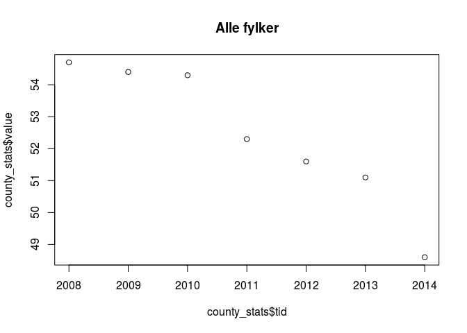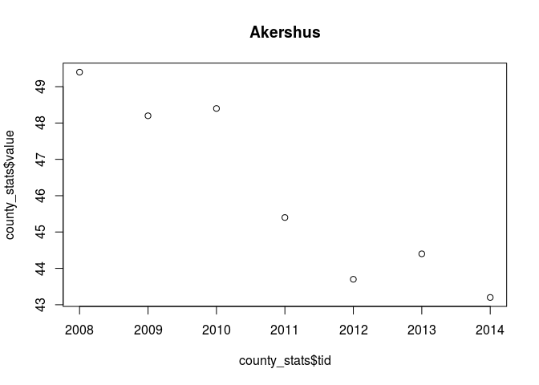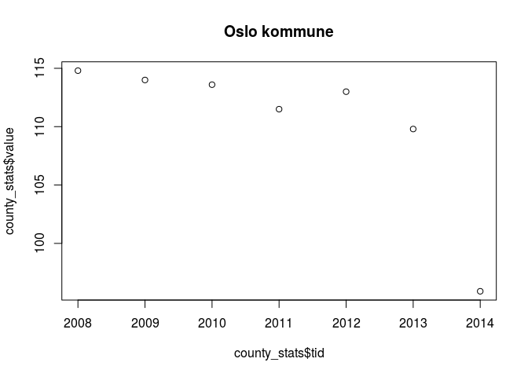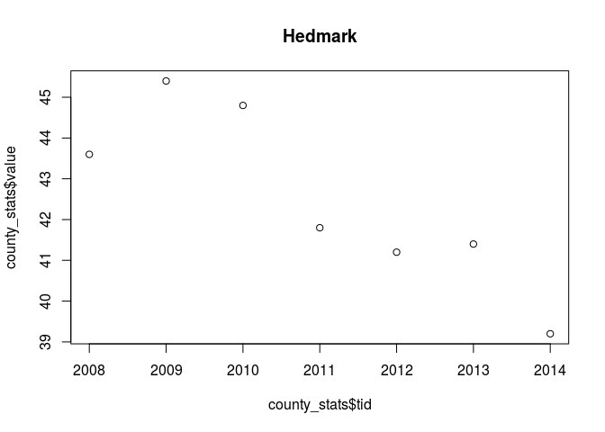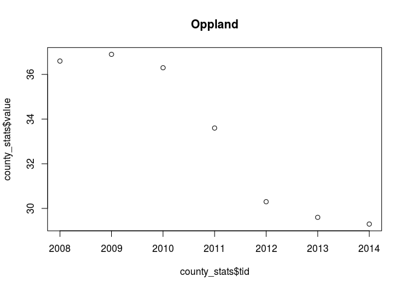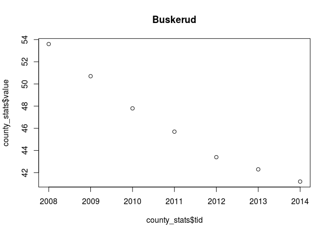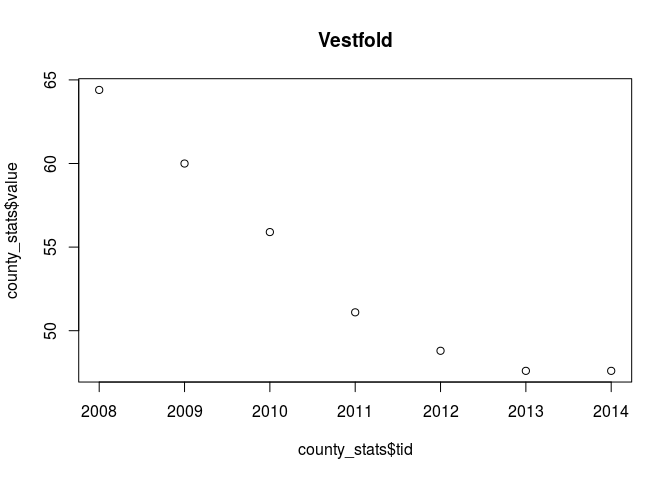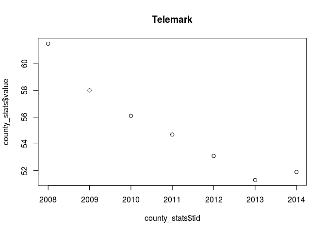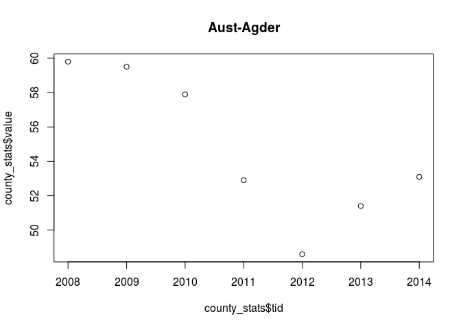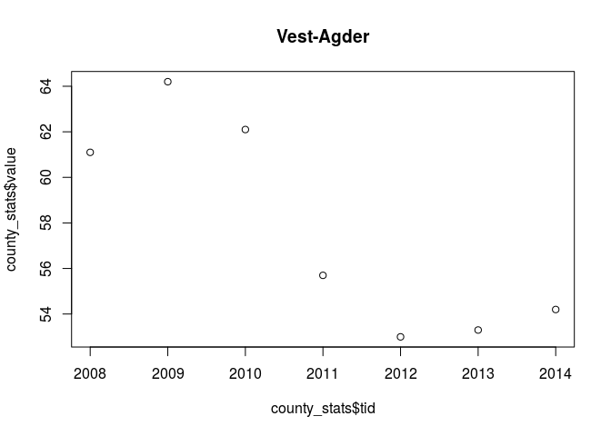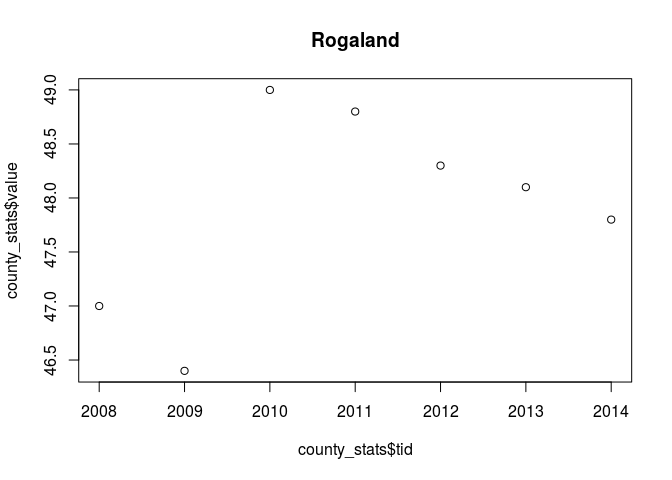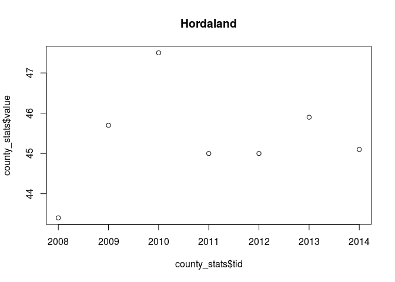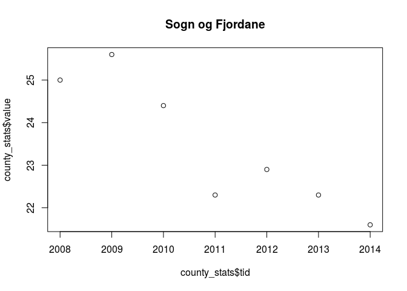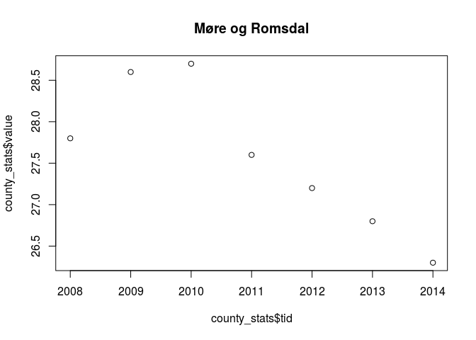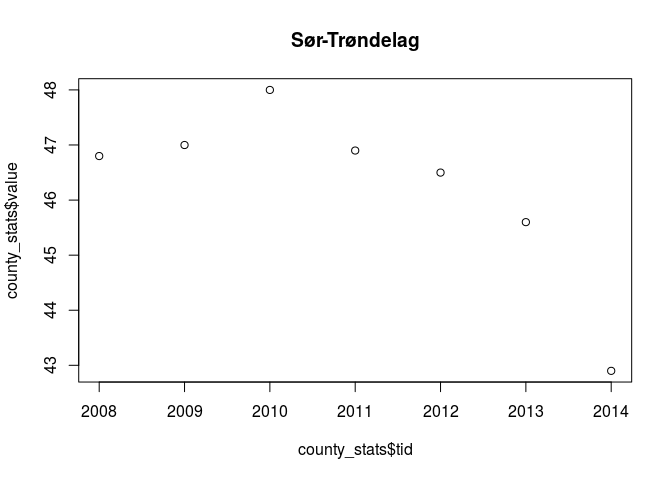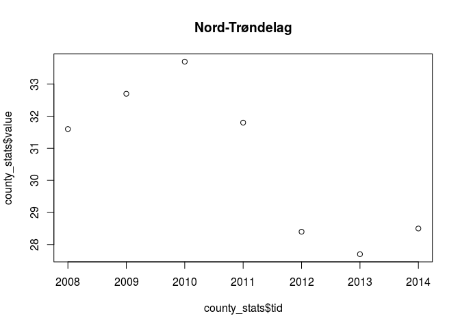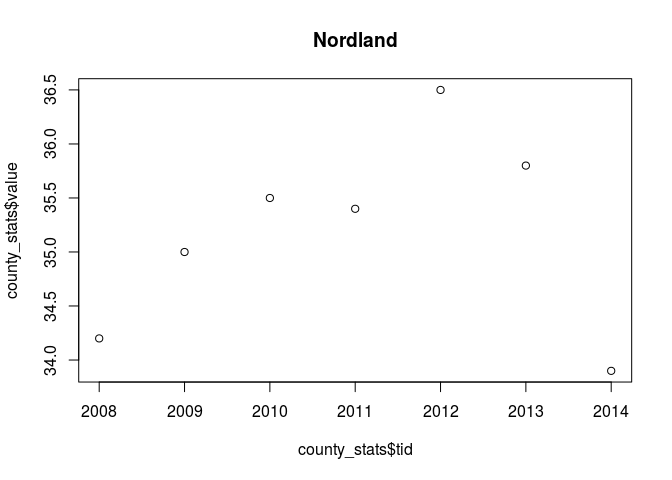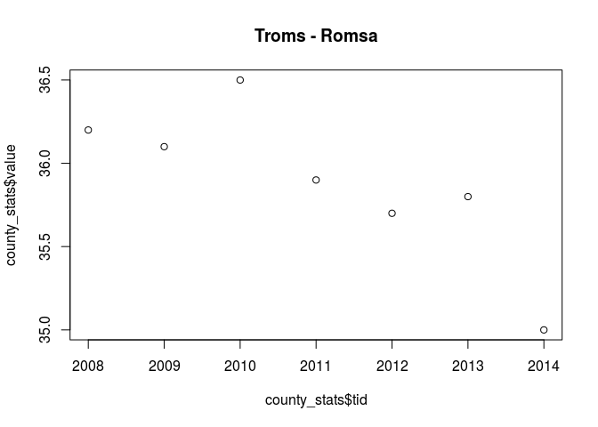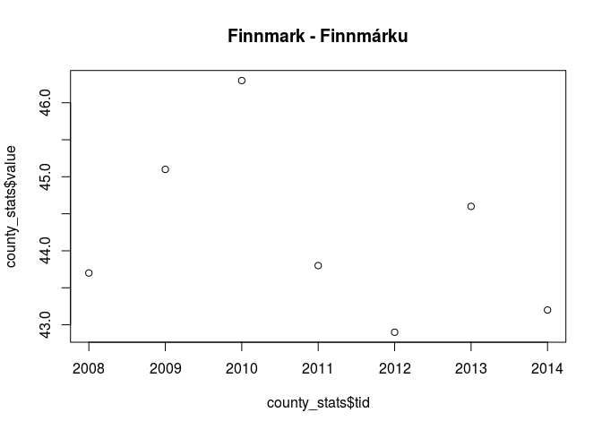
